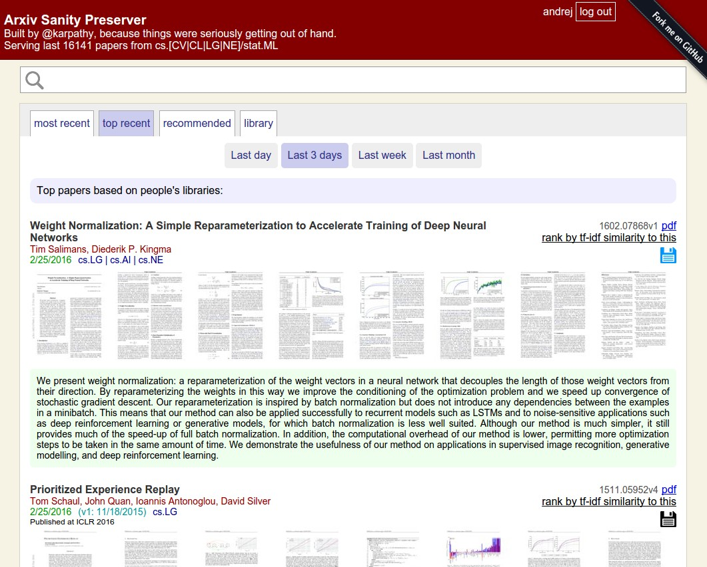

# bioarxiv sanity preserver 

Web interface for browsing, search and filtering recent bioarxiv submissions http://www.bioarxiv-sanity.com/

This project is a biology-focused analogy to Andrej Karpathy's arxiv-sanity preserver. It's a web interface that attempts to tame the overwhelming flood of papers on [bioarxiv](https://www.biorxiv.org/). It allows researchers to keep track of recent papers, search for papers, and sort papers by similarity to any paper.

This code will eventually be running at [www.bioarxiv-sanity.com/](https://www.bioarxiv-sanity.com/), where it's serving 24,000+ bioarxiv papers from over the last ~5 years. 

With this code base you could replicate the website to any of your favorite subsets of bioarxiv by simply changing the categories in `fetch_papers.py`.

Some functionality has been removed for now. There is no Twitter search to find recent popular papers. Researchers can't add papers to a personal library, or get personalized recommendations of (new or old) bioarxiv papers

### Code layout

There are two large parts of the code:

**Indexing code**. Uses bioarxiv API to download the most recent papers in any categories you like, and then downloads all papers, extracts all text, creates tfidf vectors based on the content of each paper. This code is therefore concerned with the backend scraping and computation: building up a database of bioarxiv papers, calculating content vectors, creating thumbnails, computing SVMs for people, etc. All of this code is stored in the 'indexing' directory

**User interface**. Then there is a web server (based on Flask/Tornado/sqlite) that allows searching through the database and filtering papers by similarity, etc. All of this code is stored in the 'website' directory.

### Dependencies

### Processing pipeline

### Running the website

### Current workflow

